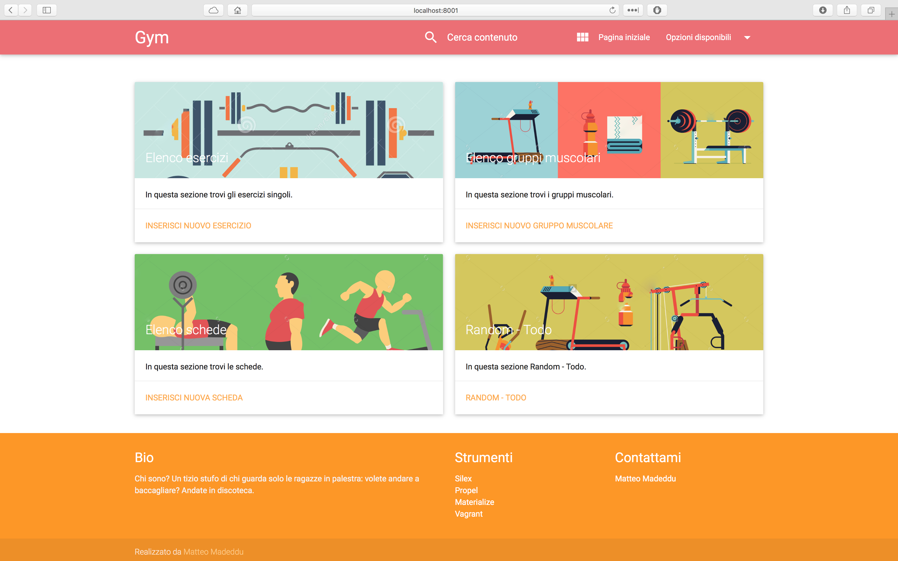
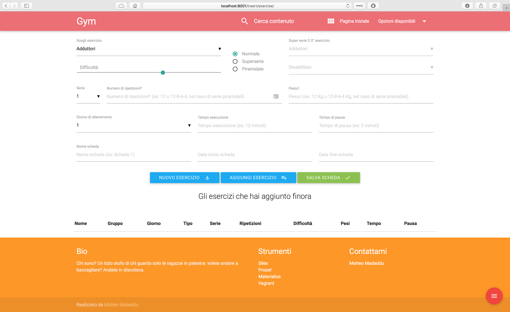
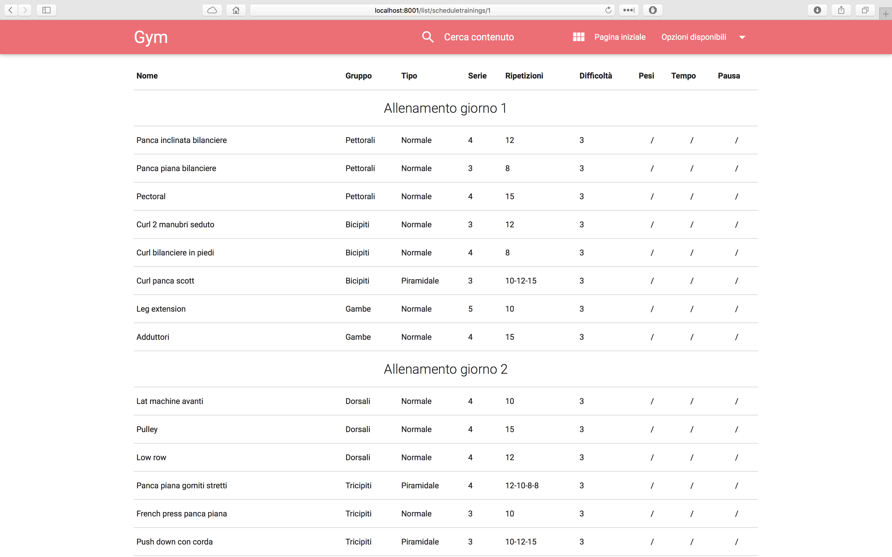

# Gym Organizer

Vagrant machine with silex + propel + materialize web app for the creation and management of gym workouts. The entire application is in italian - sorry dudes, I was newbie when I first wrote this app :-P

Simple Vagrant box including
* apache2
* php (including Xdebug)
* mysql
* gym - a [silex](http://silex.sensiolabs.org/) project

Project Structure
-------------------
* configure your silex app: **src/app.php**
* add further pages: **src/controllers.php**
* set up your database: **sql/datadefinition.sql**
* prefill your database: **sql/datamanipulation.sql**
* add twig templates: **web/templates/**

## Quick Start

First, make sure your development machine has [VirtualBox](https://www.virtualbox.org/) installed. After this, [download and install the appropriate Vagrant package for your OS](https://www.vagrantup.com/downloads.html). 
To setup a vagrant box, clone or download this repository and run vagrant up:

	git clone https://github.com/made2591/gym
	cd gym
    vagrant up

__Note__: the above `vagrant up` command will also trigger Vagrant to download the `trusty32` box via the URL specified in Vagrant file. Vagrant only does this, if it detects that the box doesn't already exist on your system (for instance, the first time). After this, you can login in Vagrant machine using `ssh`:

	vagrant ssh

The first time you run the application you need to create the DB for the very first time. To do that,

- Log-in mysql - using command line type `mysql -u root -p root` - and return. Then you will be asked the root password. If you don't know it, just search on Google how to setup the password (see note for suggestion);
- When you correctly logged in mysql type `CREATE DATABASE gym` in command line and return;
- Type exit;

__Note__: in my experience, if something's wrong with a fresh mysql setup, you can easly fix the it by purging the entire mysql-server package using `sudo apt-get purge mysql-*` and re-install it with `sudo apt-get purge mysql-*`

The entire application is under `/var/www/` folder: to see silex and propel files go to that folder:

	cd /var/www

The application should be already able to respond at:

	http://localhost:8001

__Note__: I wrote a route - under `/fixture` - that you can find in the controller: it provides a quick way to load lot of example exercises and a bunch of workouts (always in italian, sorry XD). 

	http://localhost:8001/fixture

You can use `reload_db.sh` shell script to drop and rebuild databases

## How do I use it?

### Homepage

The homepage is reachable pointing to root app url and looks like this:
<!---->

The page is divided in four section. In order from left to right:

- The first card (link in the title) let you insert a new exercise;
- The second card will let you insert a new muscle group;
- The third card will let you insert a new workout;
- The fourth card will let you create a random workout (eventually using some tuning parameters);

### Create a new workout

#### Insert a new line in workout

The exercise insertion page looks like this:
<!---->

When you filled all required fields, you can click in the middle button to temporarily add exercise to workout table. You can drag and drop element in the table and change order before saving workout (right button).

__Note__: in this page and many others, if you first run the `/fitxure`, you can correctly choose bewtween several different muscle group and setup difficulty and type of series (pyramidal series, super series).

#### Create a new exercise

The exercise insertion modal is available clicking on first button from left in insert exercise page:
<!---->

A modal appears and let you:

- Define the name of exercise;
- Choose which kind of muscles are involved in exercise;

#### Workout view

Finally, the workout view let you see the workout you defined before:
<!---->

